# mock-ML-competition-for-predicting-salary-of-office-worker

### Overview
* * *
This is a mock machine learning competition held at Kookmin University's 'Machine Learning' course.  
Overall revisions were made based on my results, which placed 8th among 15 teams.
I used Jupyter Notebook on Visual Studio Code.

### Goal
* * *
This is a regression problem that requires predicting the salary of an office worker.

### Dataset
* * *
Employee data and salary from a specific company  
(Due to security issues, the company name is not disclosed.)  
  
**X_train**: 16570 rows × 11 columns  
**X_test**: 11048 rows × 11 columns

### EDA
* * *
- X_train은 다음과 같이 생겼습니다.
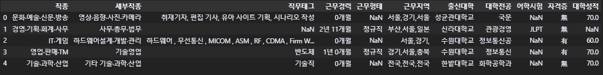

- y_train은 다음과 같이 생겼습니다.
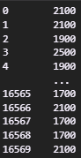

- y_train의 분포는 다음과 같습니다.
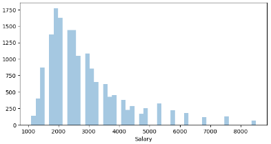

- X_train의 info를 찍어보면 다음과 같습니다.
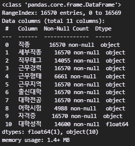

> _'직무태그'_ , _'근무형태'_ , _'어학시험'_ , _'대학성적'_ 컬럼에 결측치가 존재합니다.  
>  또한 수치형 변수들로 이루어진 _'대학성적'_ 을 제외한 모든 컬럼은 데이터타입이 'object'임을 확인할 수 있습니다.  

- 컬럼별 고유값의 개수는 다음과 같습니다.  
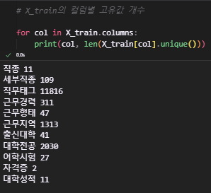

### Preprocess
* * *
개별 컬럼에 대해 전처리를 해보겠습니다.
먼저, X_train과 X_test에 같은 전처리를 해주기 위해 둘을 합치겠습니다.
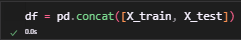
- _'직종'_ , _'세부직종'_ , _'출신대학'_ , _'자격증'_ 은 고유값 개수가 적고 결측치도 없어 전처리가 필요 없을 것 같습니다.

- _'어학시험'_ 컬럼을 살펴보겠습니다.
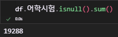
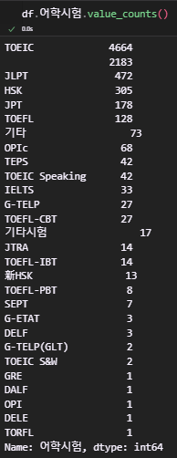

  > _'어학시험'_ 의 결측치는 '없음'으로 대체하는 것이 적절할 것 같습니다.

- _'근무경력'_ 컬럼을 살펴보겠습니다.
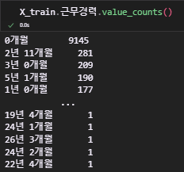

  > _'근무경력'_ 은 0년 00개월 형식입니다.  
  >  이를 모두 개월수로 바꾸어 수치형 변수로 바꿀 수 있을 것 같습니다.
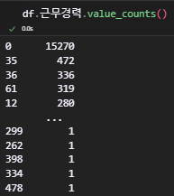

- _'대학성적'_ 컬럼을 살펴보겠습니다.  
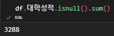

  > 출신 대학이 분명히 있으니 성적도 있을텐데 왜 결측치가 있는지는 잘 모르겠습니다.
  > 어쨌든 평균으로 대체하는 것이 가장 합리적일 것 같습니다.
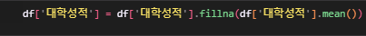

- _'근무형태'_ 컬럼을 살펴보겠습니다.
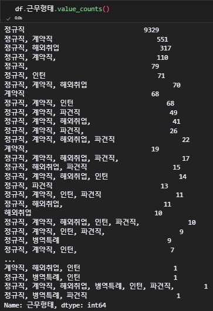
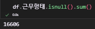

  > 근무형태가 결측치라는 것은 곧 신입이라는 뜻입니다.
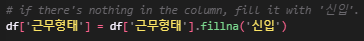

  > '정규직, 계약직,'과 같이 끝에 ,가 있는 경우가 있습니다. 따라서 마지막의 ,를 제거해주겠습니다.
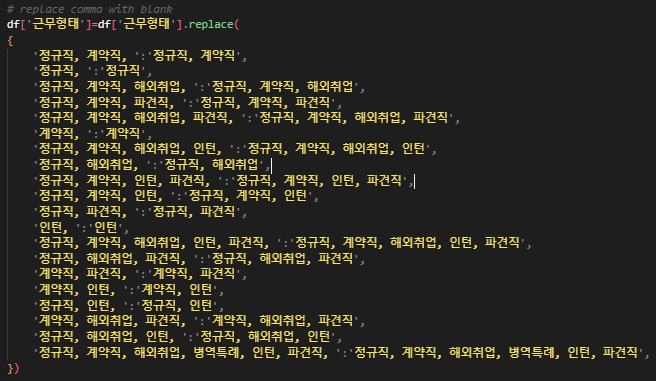

  > 결과입니다.
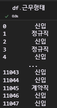

- _'대학전공'_ 컬럼을 살펴보겠습니다.
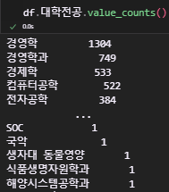
  
  > 같은 전공임에도 다르게 표현한 경우가 너무 많습니다.
  > 따라서 이들을 모두 수작업으로 통일시켜주겠습니다.
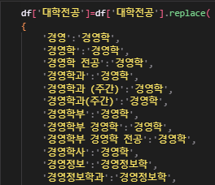

  > 결과입니다.
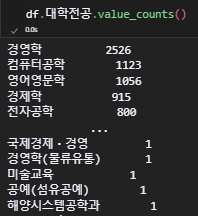

- _'직무태그'_ , _'근무지역'_ 에 대해서는 **Modeling**에서 처리하도록 하겠습니다.

### Modeling
* * *
- Modeling은 **LightGBM**과 **Catboost** 두 모델을 사용해 보았습니다.

> 첫 단계로 feature들을 타입에 맞게 구분해 주었습니다.  
> 각 타입마다 서로 다른 pipeline에 투입시킬 계획입니다.  
> 고유값을 많이 가지고 있는 NLP_features는 일반적인 범주형 변수와는 다르게 다뤄야 한다고 생각했습니다.

> Pipeline에 사용할 outlier remover와 feature selector를 정의해줍니다.

> 수치형 변수와 범주형 변수를 위한 pipeline을 구축합니다.
> 1. 수치형 변수 pipeline은 결측치 평균값 대체와 이상치를 처리해줍니다.
> 2. 범주형 변수 pipeline은 결측치 최빈값 대체와 **One-Hot-Encoding**을 수행합니다.

    범주형 변수에 대해 One-Hot-Encoding을 진행하는 까닭은 개별 범주 내의 값들의 상호 연관관계가 없다고 생각했고, 
    또한 고유값의 수가 상대적으로 적어 차원의 저주에 걸릴 가능성이 적다고 판단했기 때문입니다.

> NLP_features를 위한 pipeline을 구축합니다.
> 1. 결측치를 '없음'으로 대체합니다.
> 2. 다양한 방식으로 결합돼있는 텍스트를 모두 분리한 후 공백으로 합칩니다.
> 3. 이를 countVectorizer를 사용해 텍스트를 효과적으로 sparse matrix로 표현합니다.

> _'직무태그'_ , _'대학전공'_ 에 대해서는 TruncatedSVD를 통해 차원을 축소시켜줍니다.

> X_train과 X_test에 fit_transform 메서드를 적용합니다.

- LightGBM 모델링

> Result

- Catboost 모델링

> Catboost 모델은 범주형 변수 인코딩을 필요로 하지 않습니다.

> 따라서 범주형 변수의 One-Hot-Encoding 없이 바로 모델에 학습시킵니다.

> Result

### What needs to improve?
* * *
